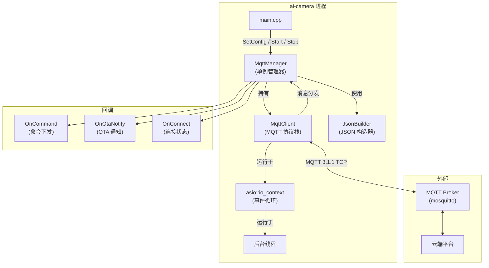

# MQTT 模块实现指南

## 目录

1. [概述](#1-概述)
2. [架构设计](#2-架构设计)
3. [MQTT 协议实现](#3-mqtt-协议实现)
4. [核心组件详解](#4-核心组件详解)
5. [配置说明](#5-配置说明)
6. [API 参考](#6-api-参考)
7. [Topic 设计](#7-topic-设计)
8. [消息格式](#8-消息格式)
9. [构建说明](#9-构建说明)
10. [测试方法](#10-测试方法)
11. [故障排除](#11-故障排除)
12. [附录](#12-附录)

---

## 1. 概述

### 1.1 模块简介

MQTT 模块为 AI Camera 项目提供物联网通信能力，实现设备与云端之间的双向消息通信。该模块作为设备主动外连的客户端，负责：

- 设备状态上报（属性、在线状态）
- AI 事件推送（人形检测、人脸识别、越界告警等）
- 云端命令接收（PTZ 控制、重启、参数配置等）
- OTA 固件升级（通知、进度同步）

### 1.2 设计原则

| 原则 | 说明 |
|------|------|
| **零依赖** | 纯 C++ 实现 MQTT 3.1.1 协议栈，不依赖 Paho MQTT 等第三方库 |
| **现代 C++** | 使用 C++20 标准，智能指针、lambda、互斥锁等现代特性 |
| **事件驱动** | 通过回调接口处理 MQTT 事件，异步操作，非阻塞 |
| **线程安全** | 使用 `std::mutex` 和 `std::atomic` 保证多线程安全 |
| **自动重连** | 指数退避重连机制，断线后自动恢复连接 |

### 1.3 技术栈

- **语言标准**：C++20
- **异步框架**：standalone Asio 1.36.0
- **MQTT 协议**：MQTT 3.1.1
- **JSON**：模块内自实现轻量 JsonBuilder
- **构建系统**：CMake

---

## 2. 架构设计

### 2.1 系统架构图



### 2.2 模块职责划分

| 组件 | 职责 | 对标项目现有模块 |
|------|------|-----------------|
| `MqttManager` | 单例入口，配置注入，业务 API（属性上报/事件推送/命令回调），生命周期管理 | OnvifManager / RtspManager |
| `MqttClient` | 封装 MQTT 3.1.1 协议，管理连接/断连/自动重连/订阅/发布/LWT/心跳 | WsServer（回调式 API） |
| `MqttConfig` | MQTT 连接配置结构体，Topic 常量，QoS 枚举 | onvif_types.h |
| `JsonBuilder` | 轻量 JSON 构建器（header-only inline） | ws/sha1.h（自实现原语） |

### 2.3 线程模型

```
┌─────────────────────────────────────────────────────────┐
│                   主线程 (main)                         │
│  - 调用 MqttManager::Start()                          │
│  - 设置回调 SetOnCommand/SetOnOtaNotify               │
│  - 调用业务 API PublishProperty/PublishEvent          │
└────────────────┬────────────────────────────────────────┘
                 │
                 │ std::thread::spawn
                 ↓
┌─────────────────────────────────────────────────────────┐
│              MQTT IO 线程 (后台线程)                     │
│  - asio::io_context::run()                            │
│  - TCP 连接/读写                                       │
│  - MQTT 报文收发                                       │
│  - 心跳定时器                                         │
│  - 重连定时器                                         │
│  - 回调 OnMessage/OnConnect/OnDisconnect              │
└─────────────────────────────────────────────────────────┘
```

**关键点**：
- `MqttClient::Publish()` 可跨线程安全调用（内部通过 `strand_` 串行化）
- 回调在 IO 线程执行，如需在回调中操作主线程资源，需自行加锁或使用 `asio::post()`

---

## 3. MQTT 协议实现

### 3.1 MQTT 3.1.1 协议概述

MQTT (Message Queuing Telemetry Transport) 是一种轻量级的发布/订阅消息传输协议，专为低带宽、不稳定网络环境设计。

**协议特点**：
- 发布/订阅模式（Pub/Sub）
- 三种 QoS 等级（At Most Once, At Least Once, Exactly Once）
- 遗嘱消息（LWT, Last Will and Testament）
- 心跳保活（Keep-Alive）
- 会话保持（Clean Session）

### 3.2 报文格式

#### 3.2.1 固定头（Fixed Header）

```
┌───────────────────────────────────────────────────────┐
│ Bit │ 7  6  5  4  │ 3  │ 2  1  │ 0                 │
│─────┼─────────────┼────┼───────┼────────────────────│
│     │ MQTT 报文类型 │ DUP│ QoS   │ Retain            │
└───────────────────────────────────────────────────────┘
┌───────────────────────────────────────────────────────┐
│                 剩余长度（Remaining Length）            │
│         1~4 字节，变长编码，最大 256MB                │
└───────────────────────────────────────────────────────┘
```

**报文类型（Packet Type）**：

| 类型 | 值 | 说明 |
|------|-----|------|
| CONNECT | 1 | 客户端连接请求 |
| CONNACK | 2 | 服务端确认连接 |
| PUBLISH | 3 | 发布消息 |
| PUBACK | 4 | QoS 1 发布确认 |
| PUBREC | 5 | QoS 2 发布收到 |
| PUBREL | 6 | QoS 2 发布释放 |
| PUBCOMP | 7 | QoS 2 发布完成 |
| SUBSCRIBE | 8 | 订阅请求 |
| SUBACK | 9 | 订阅确认 |
| UNSUBSCRIBE | 10 | 取消订阅 |
| UNSUBACK | 11 | 取消订阅确认 |
| PINGREQ | 12 | 心跳请求 |
| PINGRESP | 13 | 心跳响应 |
| DISCONNECT | 14 | 断开连接 |

#### 3.2.2 剩余长度编码（Remaining Length Encoding）

剩余长度采用 **变长字节编码**，每个字节的低 7 位表示数据，最高位表示是否还有后续字节。

**编码算法**（C++ 实现）：

```cpp
/// 编码剩余长度（1~4 字节）
/// @param value 剩余长度值（0~268,435,455）
/// @return 编码后的字节向量
std::vector<uint8_t> EncodeRemainingLength(uint32_t value) {
    std::vector<uint8_t> result;
    do {
        uint8_t byte = value % 128;
        value /= 128;
        if (value > 0) {
            byte |= 0x80;  // 继续位
        }
        result.push_back(byte);
    } while (value > 0);
    return result;
}
```

**解码算法**：

```cpp
/// 解码剩余长度
/// @param data 输入字节流
/// @param start 起始位置
/// @param bytes_read 输出：读取的字节数
/// @return 解码后的剩余长度值
uint32_t DecodeRemainingLength(const std::vector<uint8_t>& data,
                               std::size_t start,
                               std::size_t& bytes_read) {
    uint32_t multiplier = 1;
    uint32_t value = 0;
    std::size_t i = start;
    
    do {
        if (i >= data.size()) {
            throw std::runtime_error("Invalid remaining length");
        }
        uint8_t byte = data[i++];
        value += (byte & 0x7F) * multiplier;
        multiplier *= 128;
        if (multiplier > 128 * 128 * 128) {
            throw std::runtime_error("Remaining length too large");
        }
    } while ((data[i - 1] & 0x80) != 0);
    
    bytes_read = i - start;
    return value;
}
```

**示例**：

| 剩余长度值 | 编码结果（十六进制） |
|-----------|---------------------|
| 0 | `0x00` |
| 127 | `0x7F` |
| 128 | `0x80 0x01` |
| 16,383 | `0xFF 0x7F` |
| 16,384 | `0x80 0x80 0x01` |
| 268,435,455 | `0xFF 0xFF 0xFF 0x7F` |

### 3.3 CONNECT / CONNACK 握手

#### 3.3.1 CONNECT 报文构造

**固定头**：
```
0x10  // MQTT 报文类型 = CONNECT (1), 保留位 = 0
xx    // 剩余长度（变长编码）
```

**可变头**（10 字节）：
```
0x00 0x04  // 协议名长度 = 4
'M' 'Q' 'T' 'T'  // 协议名 = "MQTT"
0x04  // 协议级别 = 4 (MQTT 3.1.1)
0x02  // 连接标志（Clean Session = 1, Will = 0, Username = 1, Password = 1）
0x00 0x3C  // Keep Alive = 60 秒
```

**载荷**：
```
客户端 ID 长度 (2 字节) + 客户端 ID
用户名长度 (2 字节) + 用户名
密码长度 (2 字节) + 密码
```

**C++ 实现**（`mqtt_types.cpp`）：

```cpp
std::vector<uint8_t> BuildConnectPacket(const MqttConfig& config) {
    std::vector<uint8_t> payload;
    
    // 客户端 ID
    AppendString(payload, config.client_id);
    
    // 用户名（如果非空）
    if (!config.username.empty()) {
        AppendString(payload, config.username);
    }
    
    // 密码（如果非空）
    if (!config.password.empty()) {
        AppendString(payload, config.password);
    }
    
    // 可变头
    std::vector<uint8_t> variable_header;
    AppendString(variable_header, "MQTT");  // 协议名
    variable_header.push_back(0x04);         // 协议级别
    
    uint8_t connect_flags = 0x02;  // Clean Session
    if (!config.username.empty()) connect_flags |= 0x80;
    if (!config.password.empty()) connect_flags |= 0x40;
    variable_header.push_back(connect_flags);
    
    uint16_t keep_alive = config.keep_alive_seconds;
    variable_header.push_back(keep_alive >> 8);
    variable_header.push_back(keep_alive & 0xFF);
    
    // 固定头
    std::vector<uint8_t> packet;
    packet.push_back(0x10);  // CONNECT
    auto remaining_length = EncodeRemainingLength(
        variable_header.size() + payload.size()
    );
    packet.insert(packet.end(), remaining_length.begin(), remaining_length.end());
    packet.insert(packet.end(), variable_header.begin(), variable_header.end());
    packet.insert(packet.end(), payload.begin(), payload.end());
    
    return packet;
}
```

#### 3.3.2 CONNACK 报文解析

**固定头**：
```
0x20  // MQTT 报文类型 = CONNACK (2)
0x02  // 剩余长度 = 2
```

**可变头**（2 字节）：
```
0x00  // 会话存在标志（Session Present）
0x00  // 返回码（0 = 连接已接受）
```

**返回码说明**：

| 返回码 | 说明 |
|--------|------|
| 0x00 | 连接已接受 |
| 0x01 | 不支持的协议版本 |
| 0x02 | 不合格的客户端标识符 |
| 0x03 | 服务端不可用 |
| 0x04 | 无效的用户名或密码 |
| 0x05 | 未授权 |

**C++ 实现**（`mqtt_client.cpp`）：

```cpp
void MqttClient::ParseConnAck(const std::vector<uint8_t>& data) {
    if (data.size() < 4) {
        throw std::runtime_error("CONNACK packet too short");
    }
    
    uint8_t session_present = data[2] & 0x01;
    uint8_t return_code = data[3];
    
    if (return_code == 0) {
        std::cout << "[MQTT] CONNACK: session_present="
                  << (int)session_present
                  << ", return_code=0 (Accepted)" << std::endl;
        NotifyConnect(true);
        StartKeepAliveTimer();
    } else {
        std::cerr << "[MQTT] CONNACK error: return_code="
                  << (int)return_code << std::endl;
        NotifyConnect(false);
    }
}
```

### 3.4 PUBLISH / PUBACK / PUBREC / PUBREL / PUBCOMP

#### 3.4.1 QoS 等级说明

| QoS | 说明 | 可靠性 | 开销 |
|-----|------|--------|------|
| 0 (At Most Once) | 最多一次，不确认 | 低 | 低 |
| 1 (At Least Once) | 至少一次，可能重复 | 中 | 中 |
| 2 (Exactly Once) | 恰好一次，不重复 | 高 | 高 |

#### 3.4.2 QoS 0 流程

```
发布者 --> PUBLISH (QoS=0) --> 订阅者
```

- 发布者发送 PUBLISH 后不等待确认
- 不保证消息送达

#### 3.4.3 QoS 1 流程

```
发布者 --> PUBLISH (QoS=1, Packet ID) --> 订阅者
发布者 <-- PUBACK (Packet ID) <-------- 订阅者
```

- 发布者发送 PUBLISH 后等待 PUBACK
- 如果超时未收到 PUBACK，则重发 PUBLISH（DUP 标志置 1）
- 订阅者收到 PUBLISH 后发送 PUBACK

**C++ 实现**（`mqtt_client.cpp`）：

```cpp
void MqttClient::HandlePacket(const std::vector<uint8_t>& packet) {
    uint8_t packet_type = packet[0] >> 4;
    
    switch (packet_type) {
        case 3:  // PUBLISH
            ParsePublish(packet);
            break;
        case 4:  // PUBACK
            ParsePubAck(packet);
            break;
        // ...
    }
}

void MqttClient::ParsePublish(const std::vector<uint8_t>& data) {
    // 解析 Topic
    uint16_t topic_len = (data[2] << 8) | data[3];
    std::string topic(data.begin() + 4, data.begin() + 4 + topic_len);
    
    // 解析 Packet ID（QoS > 0 时有）
    std::size_t payload_start = 4 + topic_len;
    uint16_t packet_id = 0;
    QoS qos = static_cast<QoS>((data[0] & 0x06) >> 1);
    if (qos > QoS::AT_MOST_ONCE) {
        packet_id = (data[payload_start] << 8) | data[payload_start + 1];
        payload_start += 2;
    }
    
    // 解析 Payload
    std::string payload(data.begin() + payload_start, data.end());
    
    // 回调
    if (on_message_) {
        on_message_(topic, payload, qos, (data[0] & 0x01) != 0);
    }
    
    // QoS 1：发送 PUBACK
    if (qos == QoS::AT_LEAST_ONCE) {
        SendPacket(BuildPubAckPacket(packet_id));
    }
}
```

#### 3.4.4 QoS 2 流程（四步握手）

```
发布者 --> PUBLISH (QoS=2, Packet ID) --> 订阅者
发布者 <-- PUBREC (Packet ID) <-------- 订阅者
发布者 --> PUBREL (Packet ID) ---------> 订阅者
发布者 <-- PUBCOMP (Packet ID) <------- 订阅者
```

- QoS 2 保证消息恰好送达一次
- 通过四步握手避免重复

**C++ 实现**（`mqtt_client.cpp`）：

```cpp
void MqttClient::ParsePubRec(const std::vector<uint8_t>& data) {
    uint16_t packet_id = (data[2] << 8) | data[3];
    
    // 发送 PUBREL
    SendPacket(BuildPubRelPacket(packet_id));
}

void MqttClient::ParsePubRel(const std::vector<uint8_t>& data) {
    uint16_t packet_id = (data[2] << 8) | data[3];
    
    // 发送 PUBCOMP
    SendPacket(BuildPubCompPacket(packet_id));
}
```

### 3.5 SUBSCRIBE / SUBACK

#### 3.5.1 SUBSCRIBE 报文构造

**固定头**：
```
0x82  // MQTT 报文类型 = SUBSCRIBE (8), QoS = 1
xx    // 剩余长度
```

**可变头**：
```
Packet ID (2 字节)
```

**载荷**：
```
Topic 长度 (2 字节) + Topic + Requested QoS (1 字节)
```

**C++ 实现**：

```cpp
std::vector<uint8_t> BuildSubscribePacket(const std::string& topic, QoS qos) {
    uint16_t packet_id = AcquirePacketId();
    
    std::vector<uint8_t> variable_header;
    variable_header.push_back(packet_id >> 8);
    variable_header.push_back(packet_id & 0xFF);
    
    std::vector<uint8_t> payload;
    AppendString(payload, topic);
    payload.push_back(static_cast<uint8_t>(qos));
    
    std::vector<uint8_t> packet;
    packet.push_back(0x82);  // SUBSCRIBE (QoS 1)
    auto remaining_length = EncodeRemainingLength(
        variable_header.size() + payload.size()
    );
    packet.insert(packet.end(), remaining_length.begin(), remaining_length.end());
    packet.insert(packet.end(), variable_header.begin(), variable_header.end());
    packet.insert(packet.end(), payload.begin(), payload.end());
    
    return packet;
}
```

#### 3.5.2 SUBACK 报文解析

**固定头**：
```
0x90  // MQTT 报文类型 = SUBACK (9)
xx    // 剩余长度
```

**可变头**：
```
Packet ID (2 字节)
```

**载荷**：
```
返回码（每个 Topic 一个返回码）
```

**返回码说明**：

| 返回码 | 说明 |
|--------|------|
| 0x00 | QoS 0 已授予 |
| 0x01 | QoS 1 已授予 |
| 0x02 | QoS 2 已授予 |
| 0x80 | 失败（订阅被拒绝） |

### 3.6 PINGREQ / PINGRESP（心跳）

#### 3.6.1 PINGREQ 报文

**固定头**：
```
0xC0  // MQTT 报文类型 = PINGREQ (12)
0x00  // 剩余长度 = 0
```

#### 3.6.2 PINGRESP 报文

**固定头**：
```
0xD0  // MQTT 报文类型 = PINGRESP (13)
0x00  // 剩余长度 = 0
```

**C++ 实现**：

```cpp
void MqttClient::StartKeepAliveTimer() {
    keep_alive_timer_.expires_after(
        std::chrono::seconds(config_.keep_alive_seconds / 2)
    );
    keep_alive_timer_.async_wait(
        std::bind(&MqttClient::OnKeepAliveTimer, shared_from_this(),
                  std::placeholders::_1)
    );
}

void MqttClient::OnKeepAliveTimer(const asio::error_code& ec) {
    if (ec || !connected_) return;
    
    // 发送 PINGREQ
    SendPacket(BuildPingReqPacket());
    
    // 重新启动定时器
    StartKeepAliveTimer();
}
```

### 3.7 DISCONNECT

#### 3.7.1 DISCONNECT 报文

**固定头**：
```
0xE0  // MQTT 报文类型 = DISCONNECT (14)
0x00  // 剩余长度 = 0
```

**C++ 实现**：

```cpp
void MqttClient::Disconnect() {
    if (connected_) {
        SendPacket(BuildDisconnectPacket());
        connected_ = false;
    }
    CloseSocket();
}
```

---

## 4. 核心组件详解

### 4.1 MqttConfig（配置结构体）

**文件**：`include/ai-camera/mqtt/mqtt_types.h`

```cpp
namespace mqtt {

struct MqttConfig {
    std::string broker_host      = "127.0.0.1";  // Broker 地址
    uint16_t    broker_port      = 1883;           // Broker 端口
    std::string client_id;                          // 客户端 ID（需唯一）
    std::string username;                          // 用户名（匿名时留空）
    std::string password;                          // 密码（匿名时留空）
    bool        clean_session     = true;          // 清除会话
    uint16_t    keep_alive_seconds = 60;          // 心跳间隔（秒）
    std::string device_id         = "AICAM-001";   // 设备 ID（用于 Topic 拼接）
    
    // LWT 遗嘱消息
    std::string will_topic;       // 遗嘱 Topic
    std::string will_payload;     // 遗嘱 Payload
    QoS         will_qos         = QoS::AT_LEAST_ONCE;  // 遗嘱 QoS
    bool        will_retain      = false;         // 遗嘱 Retain
};

} // namespace mqtt
```

### 4.2 MqttClient（MQTT 客户端）

**文件**：`include/ai-camera/mqtt/mqtt_client.h`、`src/mqtt/mqtt_client.cpp`

#### 4.2.1 核心方法

| 方法 | 说明 |
|------|------|
| `SetConfig(config)` | 设置连接配置（Connect() 前调用） |
| `Connect()` | 发起连接（异步，立即返回） |
| `Disconnect()` | 断开连接（发送 DISCONNECT 后关闭） |
| `Publish(topic, payload, qos, retain)` | 发布消息 |
| `Subscribe(topic, qos)` | 订阅 Topic |
| `Unsubscribe(topic)` | 取消订阅 |
| `IsConnected()` | 查询连接状态 |

#### 4.2.2 回调设置

| 回调 | 说明 |
|------|------|
| `SetOnConnect(handler)` | 连接成功回调 |
| `SetOnDisconnect(handler)` | 断开连接回调 |
| `SetOnMessage(handler)` | 收到 PUBLISH 消息回调 |

#### 4.2.3 自动重连机制

**重连策略**：
- 连接断开后按指数退避重连
- 初始间隔：1 秒
- 每次重连间隔翻倍：1s → 2s → 4s → 8s → 16s → 30s（封顶）
- 重连成功后自动重新订阅所有 Topic

**C++ 实现**：

```cpp
void MqttClient::ScheduleReconnect() {
    if (stopped_) return;
    
    reconnect_delay_ = std::min(reconnect_delay_ * 2, MAX_RECONNECT_DELAY);
    
    std::cout << "[MQTT] Reconnecting in "
              << reconnect_delay_ << " seconds..." << std::endl;
    
    reconnect_timer_.expires_after(std::chrono::seconds(reconnect_delay_));
    reconnect_timer_.async_wait(
        [this](const asio::error_code& ec) {
            if (!ec && !stopped_) {
                DoConnect();
            }
        }
    );
}

void MqttClient::OnKeepAliveTimer(const asio::error_code& ec) {
    if (ec || !connected_) return;
    
    // 发送 PINGREQ
    SendPacket(BuildPingReqPacket());
    
    // 重新启动定时器
    StartKeepAliveTimer();
}
```

### 4.3 MqttManager（单例管理器）

**文件**：`include/ai-camera/mqtt/mqtt_manager.h`、`src/mqtt/mqtt_manager.cpp`

#### 4.3.1 单例模式

```cpp
MqttManager& MqttManager::Instance() {
    static MqttManager instance;
    return instance;
}
```

#### 4.3.2 生命周期管理

```cpp
// 初始化（在 main.cpp 中）
MqttManager::Instance().SetConfig(config);

// 启动
MqttManager::Instance().Start();

// 停止（在 signal_handler 中）
MqttManager::Instance().Stop();
```

#### 4.3.3 业务发布 API

| 方法 | Topic | QoS | 说明 |
|------|-------|-----|------|
| `PublishProperty(json)` | `.../property/post` | 1 | 上报设备属性 |
| `PublishEvent(type, json)` | `.../event/post` | 1 | 上报 AI 事件 |
| `PublishCommandResp(id, code, msg)` | `.../command/resp` | 1 | 回复命令响应 |
| `PublishOtaProgress(pct, status)` | `.../ota/progress` | 1 | 上报 OTA 进度 |
| `PublishStatus(online)` | `.../status` | 1 | 发布在线状态 |

#### 4.3.4 回调注册

```cpp
// 命令下发回调
MqttManager::Instance().SetOnCommand(
    [](const std::string& msg_id,
       const std::string& cmd,
       const std::string& params) {
        std::cout << "Command: " << cmd << std::endl;
    }
);

// OTA 通知回调
MqttManager::Instance().SetOnOtaNotify(
    [](const std::string& version,
       const std::string& url,
       const std::string& md5,
       uint64_t size) {
        std::cout << "OTA: " << version << std::endl;
    }
);

// 连接状态回调
MqttManager::Instance().SetOnConnect(
    [](bool connected) {
        std::cout << (connected ? "Online" : "Offline") << std::endl;
    }
);
```

### 4.4 JsonBuilder（JSON 构造器）

**文件**：`include/ai-camera/mqtt/mqtt_json.h`

#### 4.4.1 设计理念

- 轻量级，无需第三方 JSON 库
- 流式构造，支持链式调用
- 仅用于构造 JSON，不解析 JSON（入站消息用简单字符串匹配解析）

#### 4.4.2 使用示例

```cpp
#include "mqtt/mqtt_json.h"

std::string json = JsonBuilder()
    .Add("device_id", "AICAM-001")
    .Add("timestamp", 1719234567)
    .Add("online", true)
    .Build();

// 输出：
// {"device_id":"AICAM-001","timestamp":1719234567,"online":true}
```

#### 4.4.3 嵌套对象

```cpp
std::string json = JsonBuilder()
    .Add("device_id", "AICAM-001")
    .AddRaw("data", JsonBuilder()
                  .Add("temperature", 25.5)
                  .Add("humidity", 60.0)
                  .Build())
    .Build();

// 输出：
// {"device_id":"AICAM-001","data":{"temperature":25.5,"humidity":60.0}}
```

---

## 5. 配置说明

### 5.1 配置文件格式

MQTT 模块的配置通过 `MqttConfig` 结构体注入，可以在代码中硬编码，或从配置文件读取。

**示例：硬编码配置**

```cpp
#include "mqtt/mqtt_manager.h"

mqtt::MqttConfig config;
config.broker_host       = "127.0.0.1";
config.broker_port       = 1883;
config.client_id         = "ai-camera-test";
config.username          = "";
config.password          = "";
config.clean_session     = true;
config.keep_alive_seconds = 60;
config.device_id         = "AICAM-TEST";

// LWT 遗嘱消息
config.will_topic        = "aicamera/AICAM-TEST/status";
config.will_payload      = R"({"device_id":"AICAM-TEST","online":false})";
config.will_qos          = mqtt::QoS::AT_LEAST_ONCE;
config.will_retain       = false;

mqtt::MqttManager::Instance().SetConfig(config);
```

**示例：从 JSON 配置文件读取**

```cpp
// config.json
{
  "mqtt": {
    "broker_host": "192.168.1.100",
    "broker_port": 1883,
    "client_id": "AICAM-001",
    "username": "device",
    "password": "secret",
    "device_id": "AICAM-001"
  }
}

// main.cpp
#include <fstream>
#include <nlohmann/json.hpp>

nlohmann::json config_file;
std::ifstream("config.json") >> config_file;

mqtt::MqttConfig config;
config.broker_host = config_file["mqtt"]["broker_host"];
config.broker_port = config_file["mqtt"]["broker_port"];
// ...
```

### 5.2 命令行参数

可以在 `main.cpp` 中添加命令行参数解析：

```cpp
#include <getopt.h>

int main(int argc, char* argv[]) {
    mqtt::MqttConfig mqtt_cfg;
    mqtt_cfg.broker_host = "127.0.0.1";
    mqtt_cfg.broker_port = 1883;
    
    int opt;
    while ((opt = getopt(argc, argv, "m:p:d:")) != -1) {
        switch (opt) {
            case 'm':  // --mqtt-broker
                mqtt_cfg.broker_host = optarg;
                break;
            case 'p':  // --mqtt-port
                mqtt_cfg.broker_port = std::stoi(optarg);
                break;
            case 'd':  // --mqtt-device-id
                mqtt_cfg.device_id = optarg;
                break;
        }
    }
    
    mqtt::MqttManager::Instance().SetConfig(mqtt_cfg);
    // ...
}
```

**运行方式**：

```bash
./ai-camera.exe -m 192.168.1.100 -p 1883 -d AICAM-001
```

---

## 6. API 参考

### 6.1 MqttManager API

#### 6.1.1 生命周期

```cpp
/// 获取单例实例
static MqttManager& Instance();

/// 设置连接配置（Start() 前调用）
void SetConfig(const MqttConfig& config);

/// 启动 MQTT 客户端（异步，立即返回）
/// @return 是否成功启动连接流程
bool Start();

/// 停止并断开连接（发送 DISCONNECT，避免触发 LWT）
void Stop();

/// 是否已连接
bool IsConnected() const;
```

#### 6.1.2 业务发布 API

```cpp
/// 上报设备属性（QoS 1）
/// @param json_data JSON 字符串，如 {"temperature":25.5,"humidity":60.0}
void PublishProperty(const std::string& json_data);

/// 上报 AI 事件/告警（QoS 1）
/// @param event_type 事件类型（如 "person_detect", "face_recognize"）
/// @param json_data JSON 字符串，如 {"confidence":0.95,"bbox":[100,200,300,400]}
void PublishEvent(const std::string& event_type,
                  const std::string& json_data);

/// 上报命令执行响应（QoS 1）
/// @param msg_id 消息 ID（与命令下发时的 msg_id 对应）
/// @param code   错误码（0 = 成功）
/// @param message 消息（如 "OK", "ERROR: ..."）
void PublishCommandResp(const std::string& msg_id,
                        int code,
                        const std::string& message);

/// 上报 OTA 升级进度（QoS 1）
/// @param percent 进度 0-100
/// @param status  状态描述（如 "downloading", "installing", "done", "error"）
void PublishOtaProgress(int percent, const std::string& status);

/// 发布在线状态（由内部自动管理，也可手动调用）
/// @param online true = 上线，false = 下线
void PublishStatus(bool online);
```

#### 6.1.3 回调注册

```cpp
/// 命令下发回调
/// @param handler 回调函数，参数为 (msg_id, cmd, params)
void SetOnCommand(std::function<void(const std::string& msg_id,
                                     const std::string& cmd,
                                     const std::string& params)> handler);

/// OTA 升级通知回调
/// @param handler 回调函数，参数为 (version, url, md5, size)
void SetOnOtaNotify(std::function<void(const std::string& version,
                                       const std::string& url,
                                       const std::string& md5,
                                       uint64_t size)> handler);

/// 连接状态回调
/// @param handler 回调函数，参数为 (connected)，true = 已连接，false = 已断开
void SetOnConnect(std::function<void(bool connected)> handler);
```

### 6.2 MqttClient API

#### 6.2.1 连接管理

```cpp
/// 设置连接配置（Connect() 前调用）
void SetConfig(const MqttConfig& config);

/// 发起连接（异步，立即返回）
void Connect();

/// 断开连接（发送 DISCONNECT 报文后关闭）
void Disconnect();

/// 是否已连接
bool IsConnected() const;
```

#### 6.2.2 消息发布/订阅

```cpp
/// 发布消息
/// @param topic   Topic 字符串
/// @param payload 载荷字符串
/// @param qos     QoS 等级（默认 QoS::AT_MOST_ONCE）
/// @param retain  是否保留消息（默认 false）
/// @return 成功入队返回 true
bool Publish(const std::string& topic,
             const std::string& payload,
             QoS qos = QoS::AT_MOST_ONCE,
             bool retain = false);

/// 订阅 Topic
/// @param topic Topic 字符串（支持通配符 # 和 +）
/// @param qos  最大 QoS 等级
void Subscribe(const std::string& topic, QoS qos = QoS::AT_MOST_ONCE);

/// 取消订阅
void Unsubscribe(const std::string& topic);
```

#### 6.2.3 回调设置

```cpp
/// 连接成功回调
void SetOnConnect(std::function<void()> handler);

/// 断开连接回调
void SetOnDisconnect(std::function<void()> handler);

/// 收到 PUBLISH 消息回调
/// @param handler 回调函数，参数为 (topic, payload, qos, retain)
void SetOnMessage(std::function<void(const std::string& topic,
                                     const std::string& payload,
                                     QoS qos,
                                     bool retain)> handler);
```

---

## 7. Topic 设计

### 7.1 Topic 命名规范

采用 **层级式 Topic** 设计，格式为：

```
aicamera/{device_id}/{category}/{action}
```

- `aicamera`：统一前缀，表示 AI 摄像头产品
- `{device_id}`：设备 ID（如 `AICAM-001`）
- `{category}`：消息类别（`property`、`event`、`command`、`ota`、`status`）
- `{action}`：操作类型（`post`、`down`、`resp`、`notify`、`progress`）

### 7.2 Topic 列表

| Topic | 方向 | QoS | 说明 |
|-------|------|-----|------|
| `aicamera/{device_id}/property/post` | 设备→云 | 1 | 设备属性上报 |
| `aicamera/{device_id}/event/post` | 设备→云 | 1 | AI 事件/告警上报 |
| `aicamera/{device_id}/status` | 设备→云 | 1 | 在线状态（LWT） |
| `aicamera/{device_id}/command/down` | 云→设备 | 1 | 云端命令下发 |
| `aicamera/{device_id}/command/resp` | 设备→云 | 1 | 命令执行响应 |
| `aicamera/{device_id}/ota/notify` | 云→设备 | 1 | OTA 升级通知 |
| `aicamera/{device_id}/ota/progress` | 设备→云 | 1 | OTA 升级进度 |
| `aicamera/{device_id}/ota/result` | 设备→云 | 1 | OTA 升级结果 |

### 7.3 Topic 通配符

MQTT 支持两种通配符：

| 通配符 | 说明 | 示例 |
|--------|------|------|
| `#` | 匹配任意层级（只能放在 Topic 末尾） | `aicamera/#` 匹配所有 AI 摄像头消息 |
| `+` | 匹配单个层级 | `aicamera/+/command/down` 匹配所有设备的命令下发 |

**使用示例**（MQTT Explorer）：

- 订阅所有消息：`aicamera/#`
- 订阅所有设备属性：`aicamera/+/property/post`
- 订阅特定设备命令：`aicamera/AICAM-001/command/down`

---

## 8. 消息格式

### 8.1 统一信封结构

所有消息采用统一 JSON 信封结构：

```json
{
  "device_id": "AICAM-001",
  "timestamp": 1719234567,
  "msg_id": "uuid-xxx",
  "data": { ... }
}
```

| 字段 | 类型 | 说明 |
|------|------|------|
| `device_id` | string | 设备 ID |
| `timestamp` | integer | Unix 时间戳（秒） |
| `msg_id` | string | 消息 ID（用于去重和响应） |
| `data` | object | 消息数据（因消息类型而异） |

### 8.2 设备属性上报

**Topic**：`aicamera/{device_id}/property/post`

**Payload**：

```json
{
  "device_id": "AICAM-001",
  "timestamp": 1719234567,
  "data": {
    "firmware_version": "v1.2.3",
    "ip": "192.168.1.200",
    "temperature": 25.5,
    "humidity": 60.0
  }
}
```

### 8.3 AI 事件上报

**Topic**：`aicamera/{device_id}/event/post`

**Payload**：

```json
{
  "device_id": "AICAM-001",
  "timestamp": 1719234567,
  "event_type": "person_detect",
  "data": {
    "confidence": 0.95,
    "bbox": [100, 200, 300, 400],
    "snapshot_url": "http://192.168.1.200/snapshot.jpg"
  }
}
```

### 8.4 命令下发

**Topic**：`aicamera/{device_id}/command/down`

**Payload**：

```json
{
  "msg_id": "req-001",
  "cmd": "reboot",
  "params": {}
}
```

**支持的命令**：

| 命令 | 说明 | params |
|------|------|--------|
| `reboot` | 重启设备 | `{}` |
| `ptz_move` | PTZ 控制 | `{"direction":"up","speed":50}` |
| `set_config` | 修改配置 | `{"key":"value"}` |
| `start_rtsp` | 启动 RTSP | `{"channel":0}` |
| `stop_rtsp` | 停止 RTSP | `{"channel":0}` |

### 8.5 命令响应

**Topic**：`aicamera/{device_id}/command/resp`

**Payload**：

```json
{
  "msg_id": "req-001",
  "code": 0,
  "message": "OK"
}
```

| 字段 | 类型 | 说明 |
|------|------|------|
| `msg_id` | string | 对应命令的 msg_id |
| `code` | integer | 错误码（0 = 成功） |
| `message` | string | 错误消息 |

### 8.6 OTA 升级通知

**Topic**：`aicamera/{device_id}/ota/notify`

**Payload**：

```json
{
  "version": "v2.0.0",
  "url": "http://example.com/firmware.bin",
  "md5": "abc123...",
  "size": 1048576
}
```

### 8.7 OTA 升级进度

**Topic**：`aicamera/{device_id}/ota/progress`

**Payload**：

```json
{
  "device_id": "AICAM-001",
  "timestamp": 1719234567,
  "data": {
    "version": "v2.0.0",
    "percent": 50,
    "status": "downloading"
  }
}
```

**status 取值范围**：

| 值 | 说明 |
|-----|------|
| `downloading` | 下载中 |
| `installing` | 安装中 |
| `done` | 完成 |
| `error` | 错误 |

---

## 9. 构建说明

### 9.1 依赖项

| 依赖 | 版本 | 说明 |
|------|------|------|
| Asio | 1.36.0 | 异步 I/O 框架（header-only） |
| tinyxml2 | 最新 | XML 构造（可选，用于 GB28181 模块） |
| Visual Studio | 2022 | 编译器（支持 C++20） |

### 9.2 CMake 配置

**文件**：`CMakeLists.txt`

```cmake
# 添加 MQTT 模块源文件
set(MQTT_SOURCES
    src/mqtt/mqtt_client.cpp
    src/mqtt/mqtt_manager.cpp
    src/mqtt/mqtt_types.cpp
)

# 添加 include 路径
target_include_directories(ai-camera PRIVATE
    ${CMAKE_SOURCE_DIR}/include
    ${CMAKE_SOURCE_DIR}/third_party/asio-1.36.0/include
)

# 添加编译选项（解决中文编码问题）
if (MSVC)
    target_compile_options(ai-camera PRIVATE /utf-8)
endif()

# 链接库（Windows）
if (WIN32)
    target_link_libraries(ai-camera PRIVATE
        ws2_32
        mswsock
        advapi32
    )
endif()
```

### 9.3 编译步骤

```bash
# 1. 创建构建目录
cd e:\project\ai-camera
mkdir build
cd build

# 2. 生成构建文件
cmake ..

# 3. 编译
cmake --build . --config Debug

# 4. 运行测试程序
.\Debug\test_mqtt.exe
```

### 9.4 编译选项

| 选项 | 说明 |
|------|------|
| `/utf-8` | 指定源文件编码为 UTF-8（解决中文注释编译错误） |
| `/std:c++20` | 使用 C++20 标准（CMake 自动检测） |
| `/DEBUG` | 生成调试信息（Debug 配置） |
| `/O2` | 优化代码（Release 配置） |

---

## 10. 测试方法

### 10.1 测试环境搭建

#### 10.1.1 安装 Mosquitto（本地 Broker）

1. 下载：https://mosquitto.org/download/
2. 安装到 `C:\Program Files\mosquitto\`
3. 创建配置文件 `mosquitto.conf`：

```
listener 1883
protocol mqtt
allow_anonymous true
```

4. 启动 Mosquitto：

```powershell
cd "C:\Program Files\mosquitto"
.\mosquitto.exe -c mosquitto.conf -v
```

#### 10.1.2 安装 MQTT Explorer（图形化客户端）

1. 下载：https://mqtt-explorer.com/
2. 安装并启动
3. 连接配置：
   - Host: `127.0.0.1`
   - Port: `1883`
   - Protocol: `mqtt://`

### 10.2 单元测试

**文件**：`tests/test_mqtt.cpp`

**测试流程**：

1. 连接本地 Mosquitto Broker
2. 自动订阅 `command/down` 和 `ota/notify`
3. 定时上报属性（每 5 秒）
4. 定时上报事件（每 10 秒）
5. 接收云端命令并打印
6. 断线自动重连

**编译并运行**：

```bash
cd e:\project\ai-camera\build
cmake --build . --config Debug --target test_mqtt
.\Debug\test_mqtt.exe
```

### 10.3 集成测试

#### 10.3.1 测试属性上报

**步骤**：

1. 启动 `test_mqtt.exe`
2. 在 MQTT Explorer 中订阅 `aicamera/AICAM-TEST/#`
3. 观察 MQTT Explorer 收到消息：

```
aicamera/AICAM-TEST/property/post  → {"device_id":"AICAM-TEST","timestamp":...,"data":{...}}
aicamera/AICAM-TEST/status        → {"device_id":"AICAM-TEST","online":true}
```

#### 10.3.2 测试命令下发

**步骤**：

1. 在 MQTT Explorer 中 Publish 到 `aicamera/AICAM-TEST/command/down`
2. Payload 填写：

```json
{"msg_id":"test-001","cmd":"reboot","params":{}}
```

3. C++ 程序控制台打印：

```
[MQTT Manager] Received message: aicamera/AICAM-TEST/command/down -> {"msg_id":"test-001","cmd":"reboot","params":{}}
[MQTT Manager] Command: reboot (msg_id=test-001)
[Test] Received command: reboot (msg_id=test-001)
```

#### 10.3.3 测试断线重连

**步骤**：

1. 停止 Mosquitto Broker（Ctrl+C）
2. C++ 程序打印：

```
[MQTT] TCP connection failed: ...
[MQTT] Attempting to reconnect in 1 seconds...
```

3. 重新启动 Mosquitto Broker
4. C++ 程序自动重连成功：

```
[MQTT] TCP connected: 127.0.0.1:1883
[MQTT] CONNACK: session_present=0, return_code=0
[Test] MQTT connected!
```

### 10.4 压力测试

**测试目标**：验证高频发布/订阅的稳定性

**测试脚本**（Python + paho-mqtt）：

```python
import paho.mqtt.client as mqtt
import time
import json

client = mqtt.Client("stress-test")
client.connect("127.0.0.1", 1883, 60)

# 每秒发布 100 条消息
for i in range(1000):
    payload = json.dumps({
        "device_id": "AICAM-TEST",
        "timestamp": int(time.time()),
        "data": {"index": i}
    })
    client.publish("aicamera/AICAM-TEST/property/post", payload, qos=1)
    time.sleep(0.01)  # 10ms 间隔

client.disconnect()
```

---

## 11. 故障排除

### 11.1 编译错误

#### 错误 1：C2760: syntax error: '}' was unexpected here

**原因**：`test_mqtt.cpp` 文件编码不是 UTF-8。

**解决**：在 `CMakeLists.txt` 中添加 `/utf-8` 编译选项。

#### 错误 2：LNK2019: unresolved external symbol

**原因**：源文件未添加到 CMakeLists.txt。

**解决**：检查 `CMakeLists.txt` 中的 `set(MQTT_SOURCES ...)` 是否包含所有源文件。

### 11.2 连接错误

#### 错误 3：Connection refused

**原因**：Mosquitto 未启动，或端口配置错误。

**解决**：

1. 确认 Mosquitto 已启动：`netstat -ano | findstr ":1883"`
2. 确认 C++ 程序中 `config.broker_host` 和 `config.broker_port` 正确。

#### 错误 4：Not authorized

**原因**：Broker 配置了匿名访问禁止。

**解决**：在 `mosquitto.conf` 中添加 `allow_anonymous true`，或配置用户名密码。

### 11.3 消息错误

#### 错误 5：C++ 程序能连上，但 MQTT Explorer 收不到消息

**原因**：Topic 不匹配。

**解决**：在 MQTT Explorer 中订阅通配符 Topic `aicamera/AICAM-TEST/#`。

#### 错误 6：命令下发后 C++ 程序没有反应

**原因**：Publish Topic 错误。

**解决**：必须发布到 `aicamera/AICAM-TEST/command/down`，而非 `aicamera/AICAM-TEST`。

#### 错误 7：JSON 解析为空（msg_id 为空）

**原因**：字段名大小写错误，或 JSON 格式错误。

**解决**：确保使用 `"msg_id"` 而非 `"msgId"`，且 JSON 格式正确。

### 11.4 性能问题

#### 问题 8：高频发布时程序卡顿

**原因**：主线程被阻塞，或网络线程负载过高。

**解决**：

1. 确保 `MqttManager::Start()` 在独立线程调用
2. 降低发布频率
3. 使用 QoS 0 而非 QoS 1/2

---

## 12. 附录

### 12.1 MQTT 3.1.1 协议规范

- **官方文档**：https://docs.oasis-open.org/mqtt/mqtt/v3.1.1/os/mqtt-v3.1.1-os.html
- **中文翻译**：https://mcxiaoke.gitbooks.io/mqtt-cn/content/

### 12.2 常用 MQTT Broker 对比

| Broker | 语言 |  license | 特点 |
|--------|------|----------|------|
| Mosquitto | C | EPL/EDL | 轻量级，适合嵌入式 |
| EMQX | Erlang | Apache 2.0 | 高性能，支持集群 |
| HiveMQ | Java | 商业/社区 | 企业级，支持 MQTT 5.0 |
| VerneMQ | Erlang | Apache 2.0 | 高性能，支持集群 |

### 12.3 MQTT 客户端库对比

| 库 | 语言 |  license | 特点 |
|-----|------|----------|------|
| Paho MQTT | C/C++ | EPL | Eclipse 官方，成熟稳定 |
| mqtt_cpp | C++ | Boost | Header-only，支持 standalone Asio |
| Mosquitto | C | EPL/EDL | 轻量级，API 简单 |

### 12.4 文件清单

#### 头文件

```
include/ai-camera/mqtt/
├── mqtt_types.h       # MQTT 配置结构体和 QoS 枚举
├── mqtt_client.h      # MQTT 客户端接口
├── mqtt_json.h        # 轻量级 JSON 构造器
└── mqtt_manager.h     # MqttManager 单例接口
```

#### 源文件

```
src/mqtt/
├── mqtt_types.cpp     # MQTT 剩余长度编码/解码、报文构造
├── mqtt_client.cpp    # MQTT 客户端实现（asio 异步 TCP）
└── mqtt_manager.cpp   # MqttManager 实现（业务发布/订阅/解析）
```

#### 测试文件

```
tests/
└── test_mqtt.cpp      # MQTT 模块测试程序
```

#### 文档

```
docs/
├── mqtt_setup_guide.md          # 设置指南
├── mqtt_quick_start.md          # 快速使用指南
└── mqtt_implementation_guide.md  # 实现指南（本文档）
```

### 12.5 更新日志

| 版本 | 日期 | 说明 |
|------|------|------|
| 1.0 | 2026-06-25 | 初始版本，完成 MQTT 3.1.1 协议栈实现 |

---

**作者**：AI Assistant  
**日期**：2026-06-25  
**版本**：1.0
