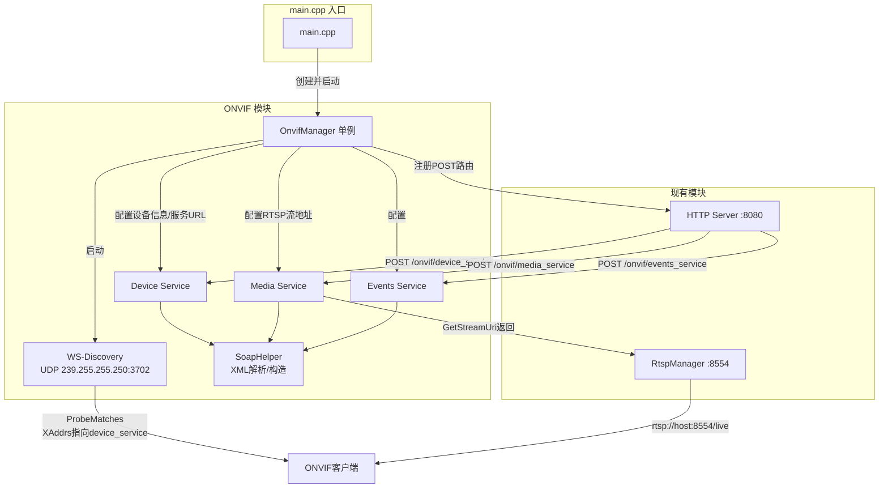

## 产品概述

为 ai-camera 项目实现 ONVIF 模块，使设备能被 ONVIF Device Manager 等标准工具自动发现并拉流。

## 核心功能

- **WS-Discovery 设备发现**：通过 UDP 多播（239.255.255.250:3702）监听 Probe 请求，响应 ProbeMatches，让客户端自动发现设备
- **Device Management 设备管理**：GetCapabilities / GetDeviceInformation / GetSystemDateAndTime / GetServices / GetScopes / GetHostname，暴露设备能力与服务端点
- **Media 媒体服务**：GetProfiles 返回 H.264 视频编码配置；GetStreamUri 返回现有 RTSP 流地址（rtsp://host:8554/live），与 RtspManager 对接
- **Events 事件服务（扩展）**：GetEventProperties / CreatePullPointSubscription / PullMessages，支持创建拉取点订阅并拉取预设事件（如移动侦测告警），贴合 AI 摄像头事件上报场景
- **SOAP 路由集成**：在现有 HTTP Server 的 Router 上注册 POST 路由（/onvif/device_service、/onvif/media_service、/onvif/events_service），处理 SOAP/XML 请求并返回 SOAP 响应

## 技术栈

- **语言/标准**：C++20（与项目一致）
- **网络框架**：Standalone ASIO（项目已有，`third_party/asio-1.36.0`），用于 UDP 多播和 TCP
- **XML 解析**：引入 tinyxml2（MIT 协议，单文件 header+source，放置 `third_party/tinyxml2/`），用于解析入站 SOAP 请求 XML 和构造出站 SOAP 响应 XML
- **HTTP 服务器**：复用项目现有 `http::Server` + `Router`，通过 `router.post()` 注册 ONVIF SOAP 端点
- **构建系统**：CMake（修改 `CMakeLists.txt` 添加 tinyxml2 include 路径和源文件）
- **无新网络依赖**：ONVIF SOAP 请求复用现有 HTTP 8080 端口，通过路径区分不同 Service；WS-Discovery 使用 ASIO UDP socket

## 实现方案

### 整体策略

手写轻量级 ONVIF 模块，完全贴合项目现有风格（ASIO + 单例管理器 + 模块化 Service）。ONVIF 基于 SOAP 1.2 over HTTP，报文为 XML，通过 tinyxml2 解析。WS-Discovery 使用 ASIO UDP 多播 socket 独立监听。所有 ONVIF SOAP 端点注册到现有 HTTP Server 的 Router 上，与 RTSP 流通过 RtspManager 对接。

### 关键技术决策

1. **复用 HTTP Server 而非新建 TCP 监听**：ONVIF SOAP 请求本质是 HTTP POST，现有 `http::Router` 已支持 POST 路由注册，无需新增网络层。不同 Service 通过路径区分（/onvif/device_service 等），零侵入现有 HTTP 逻辑。
2. **WS-Discovery 独立 UDP 模块**：WS-Discovery 使用 UDP 多播协议，与 HTTP TCP 不同，需要独立 ASIO UDP socket。参考现有 `RtspManager` 的单例 + 独立 io_context + 独立线程模式实现。
3. **SOAP 操作分发机制**：每个 Service 类内部根据 SOAP Body 中的操作名（如 `tds:GetCapabilities`）分发到对应处理函数。引入 `SoapHelper` 工具类统一处理 SOAP 信封解析/构造和 WS-Addressing 头部。
4. **Events 拉取点用条件变量实现超时等待**：PullMessages 的 Timeout 参数要求阻塞等待事件到达或超时返回，使用 `std::condition_variable` + `std::mutex` 实现，与 HTTP 请求线程同步。
5. **tinyxml2 集成方式**：tinyxml2.cpp 位于 `third_party/` 目录，不会被 `src/` 的 GLOB 自动收集，需在 CMakeLists.txt 中通过 `target_sources` 显式添加。

### 性能与可靠性

- WS-Discovery UDP 多播为低频请求（按需 Probe），无性能瓶颈
- tinyxml2 解析小尺寸 SOAP 报文（通常 < 4KB），耗时微秒级
- Events PullMessages 超时等待使用条件变量，不占用 CPU，支持并发订阅
- SOAP 请求处理在 HTTP Session 线程中同步执行，报文小、处理快，不阻塞其他连接
- 设备 IP/端口通过 OnvifManager 配置传入，支持运行时指定，避免硬编码

### 避免技术债务

- 完全复用现有 ASIO + HTTP Router + RtspManager 模式，不引入新架构范式
- OnvifManager 单例模式与 RtspManager 一致，main.cpp 集成方式一致
- 新增文件通过 CMake GLOB 自动收集（src/onvif/*.cpp），仅 CMakeLists.txt 需显式添加 tinyxml2.cpp

## 架构设计



### 数据流

1. **设备发现**：客户端发送 UDP Probe → WS-Discovery 解析 → 响应 ProbeMatches（含 XAddrs = http://host:8080/onvif/device_service）
2. **能力查询**：客户端 POST SOAP 到 /onvif/device_service → DeviceService::GetCapabilities → 返回各服务端点 URL
3. **拉流**：客户端 POST GetStreamUri → MediaService 返回 rtsp://host:8554/live → 客户端通过 RTSP 拉流
4. **事件订阅**：客户端 POST CreatePullPointSubscription → 获得订阅引用 → POST PullMessages → 阻塞等待或超时返回事件列表

## 目录结构

```
project-root/
├── CMakeLists.txt                          # [MODIFY] 添加 tinyxml2 include 路径和源文件
├── src/
│   ├── main.cpp                            # [MODIFY] 添加 ONVIF 启动/关闭、注册 SOAP 路由
│   └── onvif/                              # [NEW] ONVIF 模块源文件目录（GLOB 自动收集）
│       ├── onvif_manager.cpp               # [NEW] OnvifManager 实现：管理生命周期，注册路由，协调各 Service
│       ├── wsdiscovery.cpp                 # [NEW] WS-Discovery 实现：UDP 多播监听，Probe 解析，ProbeMatches 响应构造
│       ├── device_service.cpp              # [NEW] Device Service 实现：GetCapabilities/GetDeviceInformation/GetSystemDateAndTime/GetServices/GetScopes/GetHostname
│       ├── media_service.cpp               # [NEW] Media Service 实现：GetProfiles/GetStreamUri（返回 RTSP 流地址）
│       ├── events_service.cpp              # [NEW] Events Service 实现：GetEventProperties/CreatePullPointSubscription/PullMessages
│       └── soap_helper.cpp                 # [NEW] SOAP 工具实现：解析 SOAP 信封、提取操作名/WS-Addressing 头、构造 SOAP 响应/Fault
├── include/
│   └── ai-camera/
│       └── onvif/                          # [NEW] ONVIF 模块头文件目录
│           ├── onvif_manager.h             # [NEW] OnvifManager 单例类：Start/Stop/配置设备信息/注册路由接口
│           ├── onvif_types.h               # [NEW] 公共类型：XML 命名空间常量、DeviceInfo 结构体、ServiceConfig 配置
│           ├── soap_helper.h               # [NEW] SoapHelper 类：ParseSoapRequest/BuildSoapResponse/BuildFaultResponse
│           ├── wsdiscovery.h               # [NEW] WS-Discovery 类：UDP 多播监听器，Start/Stop
│           ├── device_service.h            # [NEW] DeviceService 类：处理设备管理 SOAP 操作
│           ├── media_service.h             # [NEW] MediaService 类：处理媒体 SOAP 操作，持有 RTSP 流地址配置
│           └── events_service.h            # [NEW] EventsService 类：管理 PullPoint 订阅列表，支持并发 PullMessages
└── third_party/
    └── tinyxml2/                           # [NEW] tinyxml2 库（MIT 协议，单文件）
        ├── tinyxml2.h                      # [NEW] tinyxml2 头文件
        └── tinyxml2.cpp                    # [NEW] tinyxml2 实现（需 CMake 显式添加到编译列表）
```

### 文件详细说明

**CMakeLists.txt [MODIFY]**

- 在 `target_include_directories` 中添加 `${CMAKE_SOURCE_DIR}/third_party/tinyxml2`
- 在 `add_executable` 后通过 `target_sources` 添加 `third_party/tinyxml2/tinyxml2.cpp`（因 GLOB 仅扫描 src/）
- 测试目标 `${PROJECT_NAME}_tests` 同步添加相同的 include 路径和 tinyxml2.cpp 源文件

**src/main.cpp [MODIFY]**

- `#include "onvif/onvif_manager.h"`
- 在 RTSP 启动后、HTTP Server 启动前，创建 OnvifManager 单例并配置设备信息（IP、端口、RTSP 流地址）
- 调用 `OnvifManager::Instance().RegisterRoutes(router)` 注册 SOAP 路由
- 调用 `OnvifManager::Instance().Start()` 启动 WS-Discovery
- 在 `signal_handler` 中调用 `OnvifManager::Instance().Stop()`

**include/ai-camera/onvif/onvif_types.h [NEW]**

- 定义 ONVIF XML 命名空间常量（tds/trt/tev/tdn/wsa/wsdd/soap 等 URI 字符串）
- `DeviceInfo` 结构体（Manufacturer/Model/FirmwareVersion/SerialNumber/HardwareId）
- `ServiceConfig` 结构体（设备IP、HTTP端口、RTSP端口、RTSP路径、各 Service URL）
- ONVIF Profile 常量（Streaming 等 Scopes）

**include/ai-camera/onvif/soap_helper.h [NEW]**

- `SoapRequest` 结构体：action、message_id、relates_to、operation_name、body_xml、parsed XMLDocument
- `SoapHelper::ParseSoapRequest(const std::string&, SoapRequest&)` → bool
- `SoapHelper::BuildSoapResponse(const std::string& action, const std::string& body_xml, const std::string& relates_to)` → std::string
- `SoapHelper::BuildFaultResponse(const std::string& fault_code, const std::string& fault_reason)` → std::string

**include/ai-camera/onvif/wsdiscovery.h [NEW]**

- `WSDiscovery` 类：持有 ASIO UDP socket 和多播端点
- `Start(const std::string& device_url, const std::vector<std::string>& scopes)` → 启动异步接收
- `Stop()` → 关闭 socket
- 内部 `handle_receive()` 解析 Probe，构造并异步发送 ProbeMatches

**include/ai-camera/onvif/device_service.h [NEW]**

- `DeviceService` 类：持有 `ServiceConfig` 和 `DeviceInfo`
- `HandleRequest(const http::Request&)` → `http::Response`：解析 SOAP 操作名，分发到对应处理函数
- 私有方法：`HandleGetCapabilities`、`HandleGetDeviceInformation`、`HandleGetSystemDateAndTime`、`HandleGetServices`、`HandleGetScopes`、`HandleGetHostname`

**include/ai-camera/onvif/media_service.h [NEW]**

- `MediaService` 类：持有 RTSP 流地址配置
- `HandleRequest(const http::Request&)` → `http::Response`
- 私有方法：`HandleGetProfiles`（返回 H.264 VideoEncoderConfiguration + VideoSourceConfiguration）、`HandleGetStreamUri`（返回 rtsp://host:8554/live）

**include/ai-camera/onvif/events_service.h [NEW]**

- `PullPointSubscription` 结构体：订阅 ID、消息队列、mutex、condition_variable、创建时间
- `EventsService` 类：管理订阅列表（`std::unordered_map<std::string, PullPointSubscription>`）
- `HandleRequest(const http::Request&)` → `http::Response`
- 私有方法：`HandleGetEventProperties`、`HandleCreatePullPointSubscription`、`HandlePullMessages`（条件变量超时等待）、`HandleUnsubscribe`
- 预设示例事件（如 MotionDetection alarm）

**include/ai-camera/onvif/onvif_manager.h [NEW]**

- `OnvifManager` 单例类（与 RtspManager 模式一致）
- `SetConfig(const ServiceConfig&)` / `SetDeviceInfo(const DeviceInfo&)`
- `RegisterRoutes(http::Router& router)` → 注册三个 POST SOAP 路由
- `Start()` → 启动 WS-Discovery UDP 监听（独立 io_context + 线程）
- `Stop()` → 停止 WS-Discovery，清理资源
- 内部持有 `WSDiscovery`、`DeviceService`、`MediaService`、`EventsService` 实例

## 实现注意事项

- **tinyxml2 编译**：tinyxml2.cpp 不会被 `src/` 的 GLOB_RECURSE 收集，必须在 CMakeLists.txt 中通过 `target_sources` 显式添加到主程序和测试程序目标
- **Windows UDP 多播**：ASIO UDP 多播在 Windows 上需要正确设置 `set_option(asio::ip::multicast::join_group)` 和 `set_option(asio::ip::multicast::enable_loopback)`，Windows socket 已链接 ws2_32
- **SOAP Content-Type**：ONVIF 响应需设置 `Content-Type: application/soap+xml; charset=utf-8`，使用 `http::Response::content_type()` 设置
- **WS-Addressing 头**：SOAP 响应需包含正确的 `wsa:Action`（响应操作名 + Response 后缀）和 `wsa:RelatesTo`（匹配请求的 MessageID），否则部分 ONVIF 客户端可能拒绝响应
- **PullMessages 线程安全**：PullMessages 在 HTTP Session 线程中阻塞等待，需确保 condition_variable 的 wait 使用正确的 predicate，避免虚假唤醒；Stop() 时需 notify_all 所有等待中的 PullMessages
- **日志**：沿用项目现有的 `std::cout` 日志风格，关键操作（Discovery 启动/路由注册/错误）输出日志
- **blast radius**：所有改动均为新增文件 + 两处修改（CMakeLists.txt 增量、main.cpp 增量），不影响现有 RTSP/HTTP/WebSocket 功能

## Agent Extensions

### SubAgent

- **code-explorer**
- Purpose: 在实现过程中，当需要确认现有代码的具体调用关系、接口签名或集成点时，使用 code-explorer 进行跨文件搜索，确保 ONVIF 模块与现有 HTTP Server、RtspManager 的集成正确无误
- Expected outcome: 确认所有集成点的接口签名和调用方式，避免集成错误